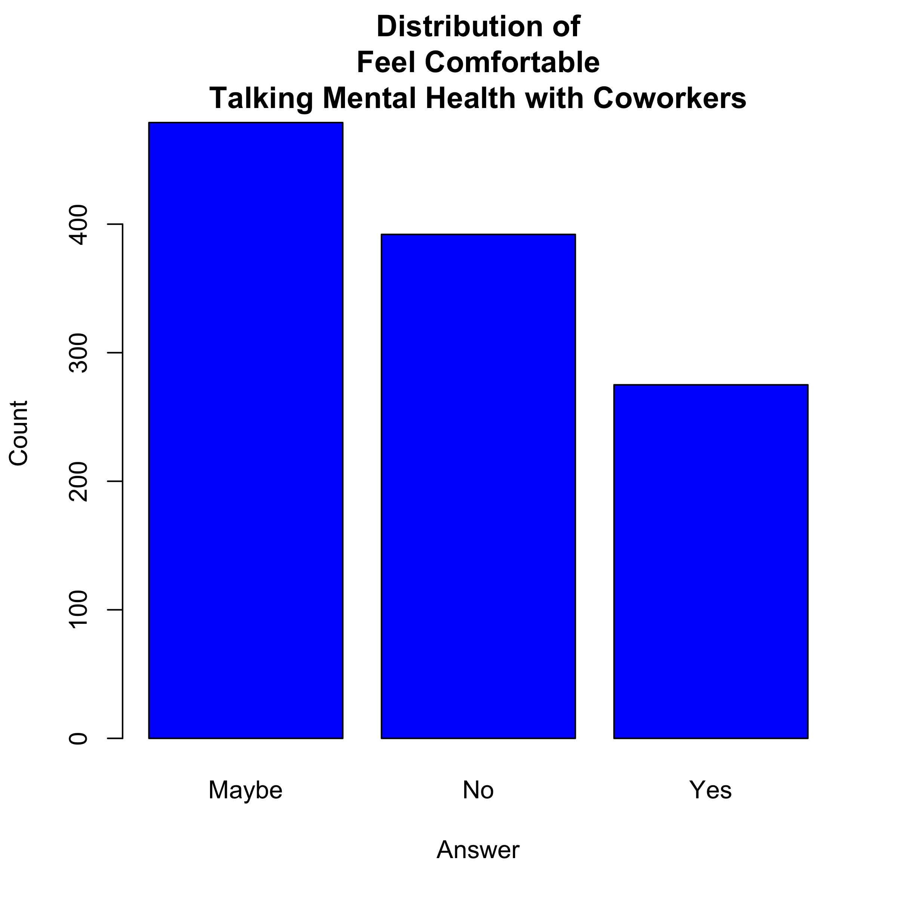

# Data And Mental Health: The OSMI Survey 2016 - Part 2

_By [Michael Rosenberg](mailto:rosenberg.michael.m@gmail.com)_

# Introduction

Hi, everyone! After performing a data analysis on the [Open Sourcing Mental
Illness](https://osmihelp.org) (OSMI) survey [previously](
https://medium.com/@tfluffm/data-and-mental-health-the-osmi-survey-2016-39a3d308ac2f), 
I received a lot of good feedback on my techniques and decisions
within the data science community and the mental health landscape. I appreciate
all of your thoughts and opinions, and I hope to stay involved in the
conversation related to data and mental health.

After looking over other components of the [OSMI Survey on Mental Health](
https://osmihelp.org/projects/research), I recognized some other components of
the dataset that could be mined for meaningful results. In particular, there 
were many assets of the survey that took into account the 
opinions of respondents towards the mental health landscape in the industry. 
Using this opinion data, I was able to construct the analysis here today.

As discussed in my previous analysis, I have some ground rules:

* If you would like clarification of this analysis, please leave a comment 
below! I want to be as clear as possible in a report.

* If you have any questions on techniques used or components studied, 
also leave a comment! I really appreciate conversations on data-mining 
strategies.

With that being said, let's dive into the data.

# The Dataset

I spent some time in my previous analysis describing the OSMI Survey in detail.
Hence, I would recommend you read through
[that section](https://medium.com/@tfluffm/data-and-mental-health-the-osmi-survey-2016-39a3d308ac2f)
of the previous analysis if you want the full details on the survey.

As mentioned earlier, the OSMI Survey contains several questions about
how respondents perceive mental health support in the workplace. Some of these
questions pertain to:

* Whether or not an employer provides coverage for mental health conditions in
the workplace healthcare plan.

* Whether an employer is supportive of mental health in the workplace.

* Whether one's colleagues (e.g. team members, direct supervisors) are
supportive of mental health in the workplace.

* If one believes mental health conditions are regarded as taboo in the
industry as a whole.

I am interested in whether or not there is a set of patterns to the answers of
these questions which might indicate narratives about mental health in the
technology industry. In particular, I wonder if there are clusters
of respondents that each have a different perspective on how mental health is
dealt with in the workplace. Once I have discovered these perspective clusters,
I hope to see whether the demographics of respondents predict these perspectives
in some meaningful manner.

# Data Exploration

One of the key limitations we have is that individuals who are
self-employed do not fill out most of the information related to their 
employer or colleagues. Thus, to analyze this dataset, we must remove
self-employed persons from the analysis. This drops our number of observations
from 1433 to 1146, which is a sizable drop. Self-employment is
a very different style of work than the typical salaried individuals working for
companies. In this sense, including them in the analysis will lead to
complicated interpretations of our results. We will only consider this group in
future analyses.

_Figure 1: Distribution of whether or not an employer provides mental health 
benefits as part of health coverage._

While a sizable number of individuals have some form of mental
health benefits as part of their health coverage, a moderate number of
individuals are either not sure about their coverage or do not have coverage on
mental health. This is immediately concerning for the tech industry, as it would
suggest that many workplace health care plans are not adequate for taking
care of mental health.

_Figure 2: Distribution of whether or not an employer offers resources to
learn more about mental health concerns and options for seeking help._

We see most respondents claim their employer does not provide meaningful
resources to educate on mental health and seek help. This again shows a trend
that employers are typically not providing the benefits nor alternative
resources to address mental health.

_Figure 3: Distribution of answers for the question "Do you think that 
discussing a mental health disorder with your employer would have negative
consequences?"_

We see most individuals lean towards "no" on this question, but there are still 
a significant portion of the sample which believes there will be negative 
consequences for discussing a mental health condition with their employers. What
these negative consequences might be would be useful to capture in a future 
survey.

_Figure 4: Distribution of comfort level talking about mental health with
coworkers_

We see from the colleague-oriented side of mental health, our sample seems
uncomfortable talking about mental health with coworkers. There may exist taboos
about discussing mental health around one's team members.

_Figure 5: Distribution of whether or not an individual was willing to bring up
a mental health issue with a potential employer during an interview._

We see most individuals believe that they wouldn't bring up a mental health
issue during an interview. For the most part, this is somewhat unsurprising, as
it might be considered not relevant to certain parts of the interview process.
However, when you compare it to whether individuals would bring up a physical
health issue in an interview (see [this notebook](https://github.com/PLBMR/mentalHealthDataAnalysis/blob/master/osmiMentalHealthInTech/analysis/clusterAnalysis/clusterAnalysis_eda.ipynb), 
Figure 11), it becomes apparent that there is a greater taboo around discussing 
mental health than discussing physical health.

# Model Selection

Given all this evidence for a taboo around mental health in the technology
workplace, I wanted to use a method that would take our responses on mental
health in the workplace and segment them into interpretable narratives. I
decided to use a [latent class model](https://en.wikipedia.org/wiki/Latent_class_model) 
(LCM) to create this segmentation.

For building a model around mental health in the workplace, I chose around $19$
questions I felt were relevant to this topic; including questions such
as:

* Does your employer provide mental health benefits as part of healthcare
coverage?

* Do you know the options for mental health care available under your 
employer-provided coverage?

* Would you feel comfortable discussing a mental health disorder with your 
direct supervisor(s)?

* Do you feel that being identified as a person with a mental health issue 
would hurt your career?

I have listed all $18$ questions in [my Git repository for the project](
https://github.com/PLBMR/mentalHealthDataAnalysis/blob/master/osmiMentalHealthInTech/data/preprocessed/variablesForClustering.txt).

(_Note: The rest of this section is rather technical. It is reasonable to skip
over it!_)

## Model Explanation

In the context of our survey, the LCM works as such:

* We have $18$ questions in the survey on mental health in the workplace. Each
individual submits answers $a_1,a_2,...,a_{18}$ to these questions respectively.

* There are $k$ perspectives on mental health in the workplace. Each perspective
$i$ carries an answer distribution $D_i.$ Hence, there are $D_1,D_2,...,D_k$
distributions, and each one is associated with a particular perspective.

* Our LCM assumes each answer group $(a_1,a_2,...,a_{18})$
comes from an answer distribution of a particular perspective. For instance, if
an individual's answers are $(a_1,a_2,...,a_{18}) \sim D_1$, then these 
answers come from perspective $1$.

* Our objective is to find the perspective assignment that best fits the
answers given by the respondents. The method we use to find this perspective
assignment is referred to as the [expected maximization algorithm](https://en.wikipedia.org/wiki/Expectation–maximization_algorithm).

This objective measuring how well we fit the answers given by respondents
is referred to as the [likelihood](https://en.wikipedia.org/wiki/Likelihood_function).
The likelihood measures how likely our model generated the answers found.

## Selection Process

We perform the following steps to select our latent class model:

1. We first split our dataset randomly into a selection set and an inference
set. We will use the selection set for solely building our final model, and we
will fit this model to the inference set for interpreting aspects of our model.

2. For selection, we will consider LCMs of between $1$ and $10$ classes. In this
context, this is considering LCMs with up to $10$ perspectives on mental health
in the workplace. To measure the performance of each of these models, we will
benchmark them using five-fold [cross-validation](https://en.wikipedia.org/wiki/Cross-validation_(statistics)) on the
$\log$ of the likelihood of the data. We will choose the model with the
highest cross-validated log-likelihood.

## Selection Results

_Figure 6: Our Cross-Validated Log-Likelihood on the number of classes
considered._

We see the cross-validated log-likelihood increases until $3$ classes,
falters a bit after $3$ classes, and then drops significantly after $5$ classes.
Thus, we will select a latent class model with $3$ classes/perspectives.

# Inference

To recap, we chose a latent class model with $3$ classes to cluster the answers
to $18$ questions into different perspectives. Now that we have this model, it
is essential to interpret our model parameters in order to define what these
perspective clusters are in our dataset.

## Exploring the Clusters

_Figure 7: The prior probabilities on our classes/perspectives discovered by our
LCM_

We can interpret each of these probabilities as the chance a randomly
picked respondent is assigned to a particular class. Thus, if we were to pull
a respondent at random, there is a $26.1\%$ chance of that respondent being from
class $1$.

The largest class in our dataset is class $3$, with classes $1$ and
$2$ being smaller groups. We see that a random respondent has close to equal
chance of being either class $1$ or $2$.

I then studied the tables of class-conditional probabilities for answers to the
$18$ questions we clustered upon. I have left most of this analysis in my
[inference notebook](https://github.com/PLBMR/mentalHealthDataAnalysis/blob/master/osmiMentalHealthInTech/analysis/clusterAnalysis/clusterAnalysis_inference.ipynb),
But it would be useful to discuss some of these tables to make a claim
about the perspectives defined by our clusters.

_Figure 8: Class-Conditional Probabilities on whether or not a respondent's
employer provides mental health benefits as part of healthcare coverage._

To interpret this table, consider each row to represent a distribution
of answers given a class assignment to a respondent. For instance, given a
respondent is assigned to class $1$, we are predicting there is a $27.2\%$
chance that they would respond "No" to this question and a $11.7\%$ chance
they would respond "Yes" to this question.

We see class $2$ primarily answers "Yes" to this question, while Classes
$1$ and $3$ generally emphasizes the other possible answers. Thus, class $2$
looks to represent individuals who often have coverage for mental 
healthcare while classes $1$ and $3$ represent individuals who either uncommonly
or rarely have coverage for mental healthcare.

_Figure 9: Class-Conditional Probabilities on whether discussing a mental
health disorder with one's employer would have negative consequences._

We see classes $1$ and $2$ generally believe there will not be negative
consequences for discussing mental health with one's employer, while class $3$
leans towards the answers of "maybe" and "yes." Thus, this suggests classes
$1$ and $2$ generally have more support on mental health from their employers
than class $3$.

_Figure 10: Class-Conditional Probabilities on answers to the question
"Would you feel comfortable discussing a mental health disorder with your 
direct supervisor(s)?"_

We see class $2$ generally feels comfortable discussing mental health with
their direct supervisor(s). Class $1$ seems to feel "yes" or "maybe" comfortable
with this type of discussion, and class $3$ generally does not seem comfortable
discussing mental health with a supervisor. This would suggest
class $2$ faces high support over mental health with their direct supervisors,
and classes $1$ and $3$ face moderate and weak support respectively.

_Figure 11: Class-Conditional Probabilities on whether or not being identified
as a person with a mental health condition would hurt one's career._

We see class $3$ generally thinks this identification would hurt their
career, while classes $1$ and $2$ generally think it would only "maybe"
hurt their career or it would not hurt their career.

## Defining the Clusters

It is apparent that class $1$ represents individuals with a high amount of
mental health benefits, moderate employer respect over mental health conditions,
moderate to high colleague respect over mental health conditions, and a 
perception of low career damage over mental health conditions. 
Class $2$ contains individuals with high employer-provided mental health 
benefits, high employer respect over mental health conditions, high colleague 
respect over mental health conditions, and a perception of moderate career 
damage over mental health conditions. Class $3$ contains individuals with 
moderate employer-provided mental health benefits, low employer and colleague 
respect over mental health conditions, and a perception of high career damage 
over mental health conditions.

In this extent, class $1$ represents a group of individuals who perceive 
moderate support in the workplace over mental health conditions, class $2$ 
represents a group of individuals who perceive high support in the workplace 
over mental health conditions, and class $3$ represents a group of individuals 
who perceive low support in the workplace over mental health conditions. Since
class $3$ is the biggest cluster and class $2$ is the smallest cluster of 
the model, this measure is slightly concerning.

## Predicting the Clusters

After defining our classes into three perspectives on the mental health
landscape in the workplace, I decided I wanted to see what demographics of
the respondents informed which perspective the respondent was assigned to. I
decided to consider the following variables in predicting our cluster
assignment:

* **gender**:
Gender of the Respondent (see [here](https://github.com/PLBMR/mentalHealthDataAnalysis/blob/master/osmiMentalHealthInTech/data/preprocessed/genderCountFrame.csv) for our mapping).

* **age**: Age of the Respondent.

* **companySize**: The company size of the respondent's employer.

* **isUSA**: Whether or not the respondent works in the United States.

* **diagnosedWithMHD**: Whether or not the respondent has been diagnosed 
with a mental health condition.

Note that these variables are very similar to our features and target variable
used in our [previous analysis](https://medium.com/@tfluffm/data-and-mental-health-the-osmi-survey-2016-39a3d308ac2f).

### Building the Model

_(Note: This section is also very technical. Feel free to skip it if you would
like!)_

Similar to our previous analysis, I decided to predict cluster assignment of
the respondents using [decision trees](https://en.wikipedia.org/wiki/Decision_tree_learning)
and [multinomial logistic regression](https://en.wikipedia.org/wiki/Multinomial_logistic_regression).
A multinomial regression is essentially a [logistic regression](https://en.wikipedia.org/wiki/Logistic_regression)
but for multiple classes as a target variable. Since we have $3$ different
classes to predict, it is essential that we use models that can handle multiple
choices for outcomes.

Since we have already performed a sizable data split, I found that performing
an additional data split for our model selection in this context would be
inappropriate. If we do an additional data split on
the inference set, we would only have a few hundred survey responses to select
our final model.

We fit our decision tree by splitting using a deviance criterion. We fit our
multinomial logistic regression using a forward-backward [stepwise
selection](https://en.wikipedia.org/wiki/Stepwise_regression) procedure over
all linear and interaction effects of our variables.

_Figure 12: Our decision tree fitted on the inference set._

Our decision tree examines **isUSA**, **diagnosedWithMHD**, **companySize**,
and **age** when considering its decision. One
point of concern is the fact that it seems never to predict class assignment $2$
in the data. To some extent, this makes its utility rather meager, as we have a
whole perspective that simply is not informed by these variables.

Our final multinomial logistic regression ended up including **age**,
**gender**, **isUSA**, **companySize**, **diagnosedWithMHD**,
and the interaction between **age** and **diagnosedWithMHD**.

Upon studying the accuracy of our models, I found the multinomial
regression is about $52.9\%$ accurate to the data and the decision tree is about
$54.6\%$ accurate to the data. Since I am looking to reduce overfitting and I
would prefer a model which predicts class assignment $2$, I decided to select
the multinomial logistic regression in this context.

### Studying the Model

For those who skipped the technical details of our previous section, we
developed a multinomial regression to predict our class assignment using
**gender**, **isUSA**, **companySize**, **diagnosedWithMHD**, and the
interaction between **age** and **diagnosedWithMHD**.

As discussed before, our model's accuracy on the inference set is around
$52.9\%$. This is a generally poor fit, as we are performing only slightly
better than if we predicted class assignment $3$ for all of our respondents
(see Figure 7).

_Figure 13: The confusion matrix for our model._

Our model is doing an extremely poor job at predicting class
assignment $2$ as it looks like we are getting $\frac{4}{122 + 4 + 10}
\approx 2.9\%$ of our predictions correct for class assignment $2$. In
particular, it seems as though our model is overpredicting class $3$ for most of
our observations. This is likely due to our classes being imbalanced, since
the class $3$ label occurs much more often in our dataset than class $1$ and $2$
observations.

_Figure 14: Our Coefficient Table for our multinomial classifier_

We see our location effect predicts those working in the USA are much
more likely to be in class $2$ and slightly more likely to be in class $3$ than
those working outside of the United States. We also see a diagnosis is
predicted to have a slight polarizing effect on perspectives, as we are 
predicting it will severely increase assignment to classes $2$ and $3$
over class $1$. We also see that as company size grows larger, the likelihood of
being assigned to class $2$ is predicted to increase, which suggests that as
companies grow bigger, it is predicted that employees find more of a 
support system for mental health exists in the workplace.

What also becomes clear is a very important gender effect. We see women
are predicted to be $e^{.313} = 1.367$ times more likely to be assigned class $3$
than men. This means that a given woman is predicted to be on average $36.7\%$
more likely to be in class $3$ than an equivalent man. When we see that the
gender effect for women on class assignment $2$ is quite small, the implication
of this is women are much more likely to feel a lack of good support
systems over mental health in the workplace than men.

The age effect is rather interesting. Consider a case where an individual is
not diagnosed with a mental health condition. An additional year of age is
predicted to multiplicatively increase the probability of an assignment to
classes $2$ and $3$ by $e^{.0666} = 1.069$ and $e^{.0597} = 1.0615$
respectively. This means each additional year is predicted to increase
the chance of these assignments by about $6.9\%$ and $6.2\%$ respectively. This
would suggest that as non-diagnosed individuals get older, there is a
dichotomizing effect. They either find there is a strong support system existing
for mental health in the workplace or they find there is a weak support system.

Let's make some point comparisons based on some relevant demographics. We will 
limit this part of the analysis to US workers at large companies. We will start 
by studying individuals of average age.

_Figure 15: Class Assignment Predictions for US workers at large firms of
average age in our survey._

We see that across the board, our model overwhelmingly predicts a class
assignment of $3$ for this age group. Thus, for average-age US workers at large
firms, we are predicting they are likely to feel weak support over mental
health in the workplace. We also see those who are diagnosed with a
mental health condition are predicted to be much less likely to be in class
$1$ than their equivalent non-diagnosed counterparts. This confirms some of the
dichotomizing aspects of mental health conditions on perspectives of support.

We see the gender effect between men and women is noticeable in this context.
In particular, diagnosed women in this demographic are predicted to be
$\frac{.44 - .36}{.44} \approx 18.18\%$ less likely to be in class $2$ and
$\frac{.59 - .51}{.51} = 15.68\%$ more likely to be in class $3$ than equivalent
men. 

# Discussion

What is important to see is that our class model predicts that more individuals
believe the support systems on mental health in the workplace are poor
than believe the support systems are moderate or strong. In fact, our model
predicts there are as many individuals believing the former perspective
than the two other perspectives combined. This would suggest that the industry
as a whole has a long way to go to completely address mental health in the
workplace.

The diagnosis effect is very strong, as it pushes individuals away from a
perspective of feeling moderately supported and polarizes groups towards
feeling either highly or weakly supported on mental health care. This is likely
due to the fact that being diagnosed with a mental health condition makes you
more attuned to the mental health resources available in your environment. In
this sense, it could be that a mental health diagnosis makes one more sensitive
to the resources and support available in the workplace, which could drive a
non-neutral opinion about a company's mental health landscape. This may be
important for companies to tap into when responding to feedback about mental
health support systems in the workplace.

Just like in our previous analysis, the gender effect is rather key to study.
This gender effect suggests women are more likely to find mental
health support systems to be weak than men. Also like our previous analysis,
there are perhaps two explanations to this effect. There is the possibility that
women are given fewer support systems over mental health than men. That being
said, there is also the possibility that women are more sensitive to the mental
health resources available in a workplace than men. The latter explanation could
potentially be supported by the fact that in our previous analysis, we found
women are more likely to claim a mental health diagnosis than men. It would
be interesting to study this effect further using adjustments to our model and
studying the causal mechanisms which link diagnosis and gender with these
perspectives.

The company size effect should also be taken into account. In particular, we
are predicting that as companies get larger, their employees are predicted to
be more likely to feel a sense of strong support over mental health in the
workplace. The likely narrative about this is that larger companies may have
the financial resources that smaller companies don't have to better support
mental health in the workplace. This doesn't account for some
of the taboos that exist about mental health when considering the opinions of
colleagues and supervisors of a worker. It's also important to note that larger
companies may have bureaucratic structures in place that would prevent
individuals from easily accessing these resources, which is counter to the
predictive effect we have discovered. To study this effect in more detail, we
may need a **companySize** variable with more granularity and a deeper
understanding of the mental health resources provided by major companies in the
tech industry.

# Limitations

There are several limitations that should be addressed:

* It is possible that our LCM is not well-specified. In particular, it assumes
each answer to the questions clustered by an LCM are conditionally
independent given the class assignment. It is very possible a respondent's
answers are highly correlated with each other even within a particular
perspective, and it might be important to consider models that account for this
issue.

* Our model to predict class assignment is currently very poor, and it generally
overpredicts the perspective of low support over mental health in the workplace.
It may be important to consider what other demographics might be needed to
better inform the perspectives of individuals on this topic.

* The interaction between age and diagnosis may be currently spurious. In
particular, it isn't considering how people are diagnosed at particular ages,
and thus perspectives may be formed at particular ages based on when they are
diagnosed rather than just on the age itself.

* It will be important to account for the nuances of those who are self-employed
in future analyses. Simply leaving them out of the analysis does not give us a
full picture of mental health support systems.

# Future Work

There are some components to consider for further analysis:

* Having more demographics to predict our class assignment would be useful for
improving this analysis. Most notably, marital status or having children may
make one more sensitive to the mental health resources available. Education
and parental background may also impact these perspectives.

* There is some language data on individual's perspectives on mental health in
the industry. While I left it out of this analysis to prevent over-complication,
it might be useful to mine this language data for further narratives about
the issue.

* It might also be useful to compare the cluster assignment of the $2014$ survey
to the current survey in order to study how perspectives on this issue change
over time.

___

 _I would like to thank [OSMI](https://osmihelp.org) for creating this survey. 
 If you appreciate the work being done at OSMI, feel free to [donate](https://www.crowdrise.com/open-sourcing-mental-illness/fundraiser/osmi)!_

_I would like to thank [Christina Keelan](https://twitter.com/ChristinaKeelan)
and [Joe Ferguson](mailto:joe@osmihelp.org) for supporting me to continue the 
analysis of the OSMI survey. I would also like to thank [Kara Ferguson](mailto:karamferg@gmail.com)
for helping to edit and revise this analysis._

_If you are interested in further studying my analysis, feel free to check out 
my code and assets [here](https://github.com/PLBMR/mentalHealthDataAnalysis/tree/master/osmiMentalHealthInTech). You can check out my whole set of projects on my GitHub profile ([PLBMR](https://github.com/PLBMR))._

_If you have any questions about the analysis, feel free to leave a comment 
below!_
