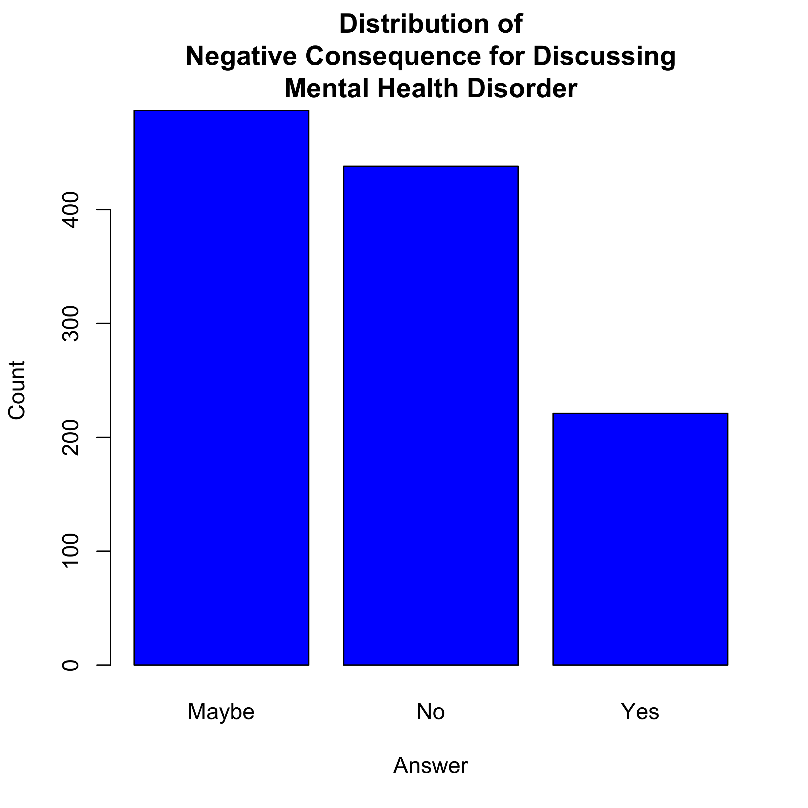

# Data And Mental Health: The OSMI Survey 2016 - Part 2

_By [Michael Rosenberg](mailto:rosenberg.michael.m@gmail.com)_

# Introduction

Hi everyone! After performing a data analysis on the [Open Sourcing Mental
Illness](https://osmihelp.org) (OSMI) survey [previously](
https://medium.com/@tfluffm/data-and-mental-health-the-osmi-survey-2016-39a3d308ac2f), 
I got a lot of good feedback on my techniques and decisions
within the data science community and the mental health landscape. I appreciate
all of your thoughts and opinions, and I hope to stay involved in the
conversation related to data and mental health.

After looking over other components of the [OSMI Survey on Mental Health](
https://osmihelp.org/projects/research), I recognized some other components of
the dataset that could be mined for meaningful results. In particular, I 
recognized that there were many assets of the survey that took into account the 
opinions of respondents towards the mental health landscape in the industry. 
Using this opinion data, I was able to construct the analysis here today.

As discussed in my previous analysis, I have some ground rules:

* If you would like clarification in this analysis, please leave a comment 
below! I want to be as clear as I can when writing a report.

* If you have any questions on techniques used or components studied, 
also leave a comment! I really appreciate conversations on data-mining 
strategies.

With that being said, let's dive into the data.

# The Dataset

I spent some time in my previous analysis describing the OSMI Survey in detail.
Hence, I would recommend that you read through
[that section](https://medium.com/@tfluffm/data-and-mental-health-the-osmi-survey-2016-39a3d308ac2f)
of the previous analysis if you want the full details on the survey.

As mentioned earlier, the OSMI Survey contains several questions pertaining to
how respondent perceive mental health support in the workplace. Some of these
questions pertain to:

* Whether or not an employer provides coverage for mental health conditions in
the workplace healthcare plan.

* Whether an employer is supportive of mental health in the workplace.

* Whether one's colleagues (e.g. team members, direct supervisors) are
supportive of mental health in the workplace.

* If one believes that mental health conditions are regarded as taboo in the
industry as a whole.

I am interested in whether or not there is a set of patterns to the answers of
these questions that might indicate narratives about mental health in the
technology industry. In particular, I wonder if there are clusters
of respondents that each have a different perspective on how mental health is
dealt with in the workplace. Once I have discovered these perspective clusters,
I hope to see whether the demographics of respondents predict these perspectives
in some meaningful manner.

# Data Exploration

One of the key limitations we have to deal with is that individuals who are
self-employed do not fill out most of the information related to their 
employer or colleagues. Thus, in order to analyze this dataset, we must remove
self-employed persons from the analysis. This drops our number of observations
from 1433 to 1146, which is a sizable drop. That being said, self-employment is
a very different style of work than the typical salaried individuals working for
companies. In this sense, including them in the analysis will lead to
complicated interpretations of our results. Thus, while it does lead to a loss
of data points, self-employed individuals should only be considered in future
analyses.

_Figure 1: Distribution of whether or not an employer provides mental health 
benefits as part of health coverage._

We see that while a sizable number of individuals have some form of mental
health benefits as part of their health coverage, a moderate amount of
individuals are either not sure about their coverage or do not have coverage on
mental health. This is immediately concerning for the tech industry, as it would
suggest that a lot of workplace health care plans are not adequate for taking
care of mental health.

_Figure 2: Distribution of whether or not an employer offers resources to
learn more about mental health concerns and options for seeking help._

We see that most respondents claim their employer does not provide meaningful
resources to educate on mental health and seek help. This again shows a trend
that employers are typically not providing the benefits nor alternative
resources to address mental health.

_Figure 3: Distribution of answers for the question "Do you think that 
discussing a mental health disorder with your employer would have negative
consequences?"_

We see that most individuals lean no on this question, but there are still a
large portion of the sample that believes there will be negative consequences
for discussing a mental health condition with their employers. What these
negative consequences might be would be useful to capture in a future survey.

_Figure 4: Distribution of confort level talking about mental health with
coworkers_

We see that from the colleague-oriented side of mental health, our sample seems
uncomfortable talking about mental health with coworkers. This suggests that
our sample feels a sense of taboo about discussing mental health around the
workplace beyond an employer's opinions.

_Figure 5: Distribution of whether or not an individual was willing to bring up
a mental health issue with a potential employer during an interview._

We see that most individuals believe that they wouldn't bring up a mental health
issue during an interview. For the most part, this is somewhat unsurprising, as
it might be considered not relevant to certain parts of the interview process,
However, when you compare it to whether individuals would bring up a physical
health issue in an interview (see [this notebook](INSERT LINK HERE), Figure 11),
it becomes apparent that there is a greater taboo around discussing mental
health than discussing physical health.

# Model Selection

Given all this evidence for a taboo around mental health in the technology
workplace, I wanted to use a method that would take our responses on mental
health in the workplace and segment them into interpretable narratives. I
decided to use a [latent class model](https://en.wikipedia.org/wiki/Latent_class_model) 
(LCM) to create this segmentation.

For building a model around mental health in the workplace, I chose around $19$
questions that I felt were relevant to this topic. This includes questions such
as:

*  
* INSERT QUESTION HERE

* INSERT QUESTION HERE

* INSERT QUESTION HERE

I have listed all $19$ questions in [my git respository for the project](
INSERT LINK HERE).

(_Note: The rest of this section is rather technical. It is reasonable to skip
over it!_)

## Model Explanation

In the context of our survey, the LCM works as such:

* We have $19$ questions in the survey on mental health in the workplace. Each
individual submits answers $a_1,a_2,...,a_{19}$ to these questions respectively.

* There are $k$ perspectives on mental health in the workplace. Each perspective
$i$ carries an answer distribution $D_i.$ Hence, there are $D_1,D_2,...,D_k$
distributions, and each one is associated with a particular perspective.

* Our LCM assumes that each answer group $(a_1,a_2,...,a_{19})$
comes from an answer distribution of a particular perspective. For instance, if
an individuals answers $(a_1,a_2,...,a_{19}) \sim D_1$, then these answers come
from perspective $1$.

* Our objective is to find the perspective assignment that best fits the
answers given by the respondents. The method we use to find this perspective
assignment is referred to as the [expected maximization algorithm](INSERT LINK
HERE).

This objective that measures how well we fit the answers given by respondents
is referred to as the [Likelihood](INSERT LINK HERE). The likelihood measures
how likely our model generated the answers found.

## Selection Process

We perform the following steps to select our latent class model:

1. We first split our dataset randomly into a selection set and an inference
set. We will use the selection set for solely building our final model, and we
will fit this model to the inference set for interpreting aspects of our model.

2. For selection, we will consider LCMs of between $1$ and $10$ classes. In this
context, this is considering LCMs with up to $10$ perspectives on mental health
in the workplace. To measure the performance of each of these models, we will
benchmark them using five-fold [cross-validation](INSERT LINK HERE) on the
$\log$ of the likelihood of the data. We will choose the model with the
highest cross-validated log-Likelihood.

## Selection Results

_Figure 6: Our Cross-Validated Log-Likelihood on the number of classes
considered._

We see that the cross-validated log-likelihood increases until $3$ classes,
falters a bit after $3$ classes, and then drops significantly after $5$ classes.
Thus, we will select a latent class model with $3$ classes/perspectives.

# Inference

To recap, we chose a latent class model with $3$ classes to cluster the answers
to $19$ questions into different perspectives. Now that we have this model, it
is essential to interpret our model parameters in order to define what these
perspective clusters are in our dataset.

## Defining the Clusters

!
## Predicting the Clusters

# Discussion

# Limitations

# Future Work
